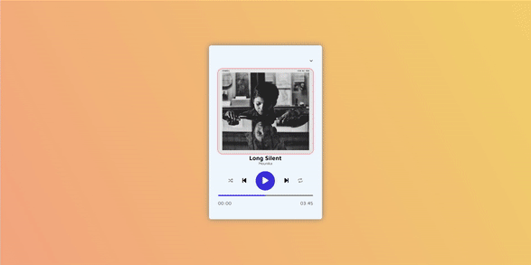

# Music-Player

I created a music player site. In the design, I implemented the dynamics with JavaScript along with CSS. 

As seen in the design, there are start, stop, forward, backward, shuffle and loop buttons and I activated these buttons with javascript.
With the bar at the bottom, I made it possible to listen to the songs at any time and added time counters that show the length of the songs.
Finally, I completed the song player by adding the song list to the project in JSON format.

<h2>Used Tech.</h2> 
<ul>
  <li>HTML was used.</li>
  <li>CSS was used in design.</li>
  <li>Javascript was used in dynamics.</li>
</ul>
<h2>Screen</h2>

